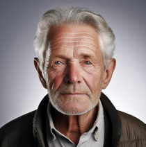

# Especificação do projeto:

Nesta parte da documentação, criamos três personas, com três problemas cada, a fim de visualizar a partir da própria dor do usuário, os problemas diários que podem necessitar de algum tipo de intervenção ou desenvolvimento de tecnologia.

## Personas
Segue abaixo as três personas do projeto, e as ideias que podemos desenvolver a partir destes possíveis usuários. Cada persona tem três problemas.

|**Felipe de Souza**|           |                             | 
|-------------------|-----------|-----------------------------|
|**Idade:** 12 anos. **Naturalidade:** Águas da Prata, SP. | **Condição:** Amputação (Amputação de membro inferior devido a um acidente).       |**Objetivos:** Recuperar a autoestima e parte da mobilidade, a fim de se adaptar a sua nova realidade
|**Desafios:** Reintegração nas atividades do dia a dia.  |**Cuidadores:** Familiares, amigos e equipe multidisciplinar que trabalham para oferecer suporte emocional e físico.  |

|EU COMO... `PERSONA`| QUERO/PRECISO ... `FUNCIONALIDADE` |PARA ... `MOTIVO/VALOR`                 |
|--------------------|------------------------------------|----------------------------------------|
|Felipe de Souza | Exercícios focados | Reintegrar suas atividades do dia a dia. |
|Felipe de Souza | Otimização do seu esforço | Melhorar seu processo de reabilitação. |
|Felipe de Souza | Monitoramento da sua evolução | Entender sua evolução durante o processo de reabilitação. |

|**Caio Almeida**|           |                             | 
|-------------------|-----------|-----------------------------|
|**Idade:** 18 anos. **Naturalidade:** Poços de Caldas, MG. | **Condição:** Síndrome de Down.  |**Objetivos:** Completar o ensino médio e conseguir um emprego que valorize suas habilidades.
|**Desafios:** Inclusão no mercado de trabalho.  |**Personalidade:** Alegre, comunicativo, e determinado a conquistar seu espaço na sociedade, Caio é muito sociável e gosta de estar rodeado de amigos e família. |

|EU COMO... `PERSONA`| QUERO/PRECISO ... `FUNCIONALIDADE` |PARA ... `MOTIVO/VALOR`                 |
|--------------------|------------------------------------|----------------------------------------|
|Caio Almeida | Encontrar uma oportunidade no mercado de trabalho. | Ganhar mais independência e se desenvolver. |
|Caio Almeida | Aprender a realizar tarefas diárias. | Para ganhar mais autonomia no seu dia a dia. |
|Caio Almeida | Ter acesso a ferramentas de organização e aprender a utilizá-las. | Concluir o ensino médio com sucesso. |

|**João Carlos**|           |                             | 
|-------------------|-----------|-----------------------------|
|**Idade:** 70 anos. **Naturalidade:** Pouso Alegre, MG. | **Condição:** Lesão medular adquirida após queda.  |**Objetivos:** Recuperar a maior independência possível e adaptar-se à nova realidade de vida com a lesão.
|**Desafios:** Perda de mobilidade, necessidade de adaptação e luto pela perda da antiga autonomia.  |**Cuidadores:** Esposa e filhos que assumem papel central no cuidado diário, com apoio de profissionais de saúde. |

|EU COMO... `PERSONA`| QUERO/PRECISO ... `FUNCIONALIDADE` |PARA ... `MOTIVO/VALOR`                 |
|--------------------|------------------------------------|----------------------------------------|
|João Carlos | Um sistema para realizar meus exercícios de fisioterapia | continuar seu tratamento, mesmo quando não puder comparecer às sessões. |
|João Carlos | Uma maneira para poder registrar minha evolução diária na fisioterapia  | Para monitorar minha evolução. |
|João Carlos | Uma maneira da minha família se comunicar com a instituição | Para ficarem antenados com meus diagnósticos e melhorias |

|**Ana Luiza**|           |                             | 
|-------------------|-----------|-----------------------------|
|**Idade:** 35 anos. **Profissão:** Terapeuta ocupacional. **Especialidade:** Reabilitação de crianças com paralisia cerebral. | **Objetivo:** Melhorar a eficiência no atendimento terapêutico, utilizando ferramentas tecnológicas que otimizem o desenvolvimento motor e cognitivo das crianças. |
|**Desafios:** Sobrecarga de trabalho, dificuldade em personalizar o tratamento devido ao volume de pacientes e falta de ferramentas tecnológicas que engajem as crianças. | **Atividades Diárias:** Trabalha com várias crianças diariamente, lidando com diferentes graus de paralisia cerebral. Utiliza recursos tradicionais de terapia e comunicação direta com famílias e equipe multidisciplinar. |

|EU COMO... `PERSONA`| QUERO/PRECISO ... `FUNCIONALIDADE` |PARA ... `MOTIVO/VALOR`                 |
|--------------------|------------------------------------|----------------------------------------|
|Ana Luiza | Um sistema para personalizar as atividades de cada criança de forma eficiente | Para otimizar o tempo e aumentar a qualidade do atendimento. |
|Ana Luiza | Uma maneira de monitorar o progresso das crianças entre as sessões de forma remota | Para ajustar as terapias conforme a necessidade de cada paciente. |
|Ana Luiza | Um meio de engajar mais as crianças durante as atividades terapêuticas | Para tornar o processo de reabilitação mais interessante e divertido para elas. |
|Ana Luiza | Uma forma de se comunicar melhor com os pais sobre o progresso dos filhos | Para garantir que o acompanhamento seja contínuo mesmo fora do ambiente clínico. |

